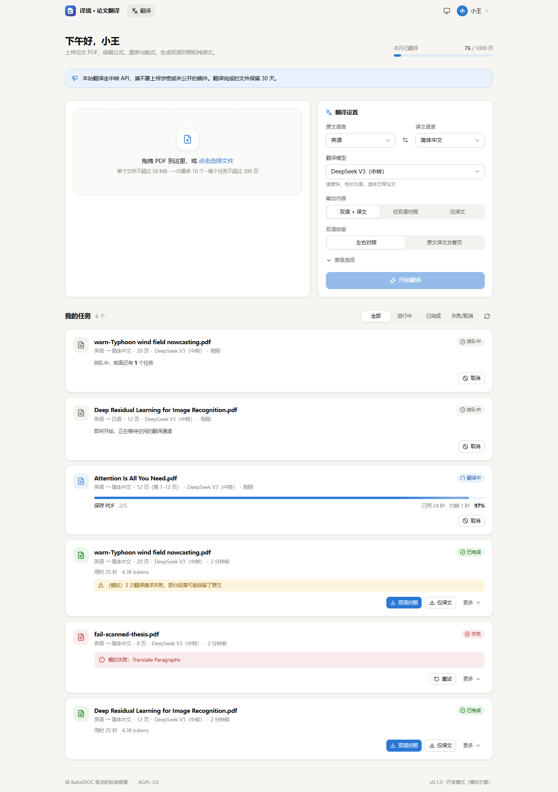
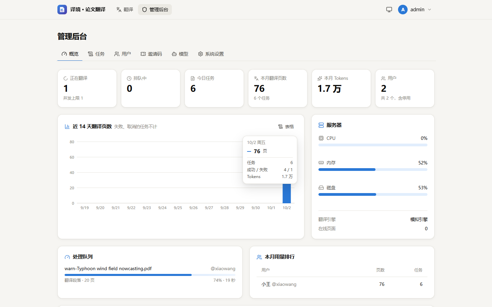
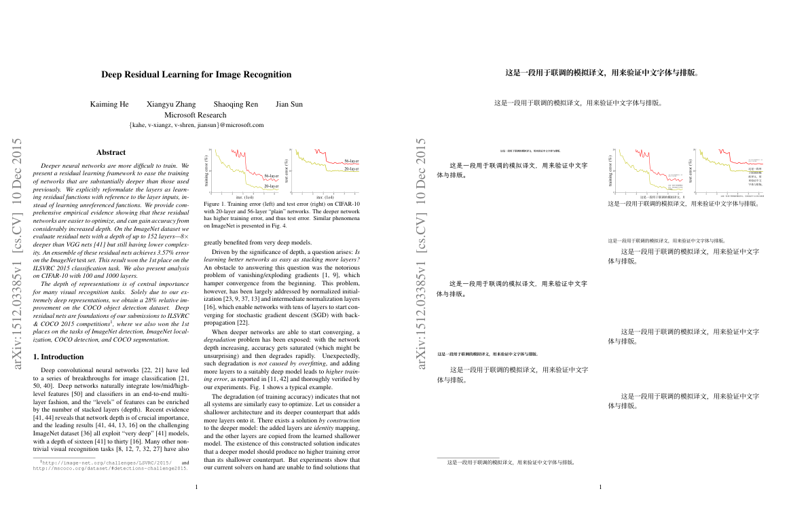

# BabelDOC Web

自托管的多用户学术 PDF 翻译站：上传论文，保留公式、图表与版式，生成**双语对照**和**纯译文** PDF；另带一套在浏览器里运行的 **PDF 处理工具**（合并、拆分、压缩、OCR、PDF 转 Word、Office 转 PDF 等）。
A self-hosted, multi-user web service for [BabelDOC](https://github.com/funstory-ai/BabelDOC), plus in-browser PDF tools.

[](LICENSE)
[](https://www.python.org/)
[](https://github.com/funstory-ai/BabelDOC)
[](https://svelte.dev/)

| 翻译页 | 管理后台 | 产出（左原文 / 右译文） |
| --- | --- | --- |
|  |  |  |

前两张截图里的用户、任务和用量是本地模拟数据；第三张是真实翻译结果（《Attention Is All You Need》第 1 页）。另有[深色模式](docs/screenshots/home-dark.png)、[手机端](docs/screenshots/mobile.png)和[模型管理](docs/screenshots/admin-models.png)截图。

## 为什么做这个

[BabelDOC](https://github.com/funstory-ai/BabelDOC) 翻译论文时能很好地保留版式，但它是命令行工具和 Python 库：要装 Python、下载几百 MB 的模型、自己配置模型 API。想让不写代码的朋友也用上，就需要一个网页——管理员配好模型接口，大家登录后拖进 PDF 就能翻译。

功能设计参考了 [DocBabel](https://github.com/ccsert/DocBabel)，但本项目的目标是**一台小 VPS 就能跑，维护负担尽量小**：

- **部署轻**：一个 uvicorn 进程 + SQLite + systemd，不需要 Docker、PostgreSQL、Redis 或 nginx；
- **引擎隔离**：BabelDOC 装在独立的虚拟环境里、版本精确锁定，以子进程运行，升级引擎不碰 Web 后端的依赖；
- **结果可信**：开工前先测模型接口，翻译中统计每次请求的成败，不会把“接口全部失败、原文原样输出”当成翻译成功；
- **一键上线**：部署脚本负责打包、安装和健康检查，失败自动回滚。

## 功能

### 用户

- 邀请码注册（管理员也可改为开放注册或关闭注册）
- 拖拽批量上传，一次最多 10 个 PDF；13 种语言互译，可选翻译模型
- 输出：双语 + 译文 / 仅双语 / 仅译文；双语排版：左右对照 / 原文译文交替页
- 高级选项：页码范围、自动提取术语、术语提取模型（可与翻译模型不同）、翻译表格中的文字、兼容模式、扫描件自动兼容、双语中译文页在前、只输出所选页、译文字体（衬线 / 无衬线 / 手写）、自定义提示词、上传术语表 CSV（提供模板）
- 实时进度：当前阶段、百分比、已用时间与预计剩余、排队位置
- 下载双语 / 译文 / 自动提取的术语表 / 原文，可在线预览；失败可重试，排队或进行中的任务可取消
- 原文与译文按保留期（默认 30 天）自动删除，上传区和任务卡片都会提示还剩几天
- 月度页数额度、修改昵称与密码、亮暗主题、手机可用

### PDF 处理

顶部「PDF 处理」标签里有 16 个工具。文件只在使用者自己的浏览器里处理，不上传到服务器；处理所需的引擎、语言包和字体全部由本站分发，不访问任何第三方 CDN，第一次用到某个工具时才下载它需要的引擎，之后由浏览器缓存。

| 分类 | 工具 | 引擎（首次下载量，brotli 压缩后） |
| --- | --- | --- |
| 页面整理 | 合并、拆分 / 提取、页面整理（缩略图拖动排序、旋转、删除、插入空白页）、旋转 | qpdf（约 0.4 MB），页面整理另用 PDF.js |
| 编辑 | 添加水印（文字含中文 / 图片）、添加页码（含“第 1 页”格式）、文档属性（查看、修改、清除元数据） | pdf-lib；含中文时下载所选字体（约 6–10 MB） |
| 格式转换 | PDF 转图片、图片转 PDF、PDF 转 Word、Office 转 PDF、转为 PDF/A | PDF.js；PyMuPDF + pdf2docx（约 40 MB）；LibreOffice（约 58 MB，中文文档另需字体）；Ghostscript（约 11 MB） |
| 优化与识别 | 压缩（无损 / 标准 / 强力 / 高质量）、OCR 文字识别（中英文，生成可搜索 PDF） | Ghostscript；Tesseract 与中英文语言包（约 6 MB） |
| 安全 | 加密（打开密码、权限）、解除密码 / 权限限制 | qpdf |

- 加密的 PDF 会先询问打开密码；知网等来源常见的“只限制权限”的文件会自动处理；
- Office 转 PDF 时按文档用到的字体注入中文字体：宋体→思源宋体、黑体 / 雅黑 / 等线→思源黑体、楷体→霞鹜文楷、仿宋→朱雀仿宋，Times New Roman、Arial、Calibri、Cambria 等用度量兼容的开源字体；转换时浏览器约占 1.5 GB 内存，需要电脑端浏览器；
- 处理逻辑移植自 [BentoPDF](https://github.com/alam00000/bentopdf)（AGPL-3.0），界面按本站设计重写。用到的第三方组件与许可证见 [THIRD_PARTY_NOTICES.md](THIRD_PARTY_NOTICES.md)。

### 管理员

- **概览**：运行与排队数、今日与本月用量、近 14 天页数图、CPU / 内存 / 磁盘、处理队列、失败记录、用量排行
- **任务**：搜索与筛选、查看引擎日志、取消 / 重试 / 删除
- **用户**：新建、停用、改角色、单独设置额度、重置密码
- **邀请码**：可用次数、有效期、撤销，一键复制注册链接
- **模型**：任意 OpenAI 兼容接口（含中转站）；API Key 加密存储、不下发浏览器；测试连接、拉取模型列表、设默认模型；可调 QPS、并发线程、是否发送 temperature、JSON 模式，可另配术语提取模型
- **系统设置**：站名与公告、注册方式、并发数、上传与页数上限、每人同时任务数、默认额度、文件保留天数、默认语言、水印

## 架构

```
浏览器 ──HTTPS── 反向代理 / Cloudflare Tunnel ──► 127.0.0.1:8090  uvicorn（FastAPI，同时托管前端静态文件）
                                                   │  SQLite（WAL）· SSE 推送进度 · 任务调度（并发上限、按用户公平取队）
                                                   └─► 子进程 engine/runner.py ──► babeldoc（独立 venv，版本锁定）
                                                         stdout 以 JSON lines 汇报进度；取消 = 杀掉整个进程组
```

| 目录 | 内容 |
| --- | --- |
| `backend/` | FastAPI + SQLAlchemy + SQLite：账号、队列调度、SSE、管理接口，并托管前端构建产物。不 import babeldoc |
| `engine/` | 独立 uv 项目（Python 3.12，babeldoc 精确锁定）。`runner.py` 是唯一直接调用 babeldoc 的文件，`mock_runner.py` 是同协议的模拟引擎 |
| `frontend/` | Svelte 5 + Vite + Tailwind CSS 4 |
| `deploy/` | `deploy.sh`（本地一键部署）、`remote.sh`（服务器端安装 / 回滚 / 运维）、systemd 单元、配置模板 |

### 引擎协议

后端以子进程运行 `runner.py <任务描述.json>`。任务描述里不含密钥，API Key 只经环境变量 `BDW_API_KEY` 传入；任务单独选了术语提取模型时，它的配置放在任务描述的 `model.term`，密钥走 `BDW_TERM_API_KEY`，不会把主密钥发给别的接口。runner 在 stdout 上每行输出一个 JSON 事件：

```json
{"event": "started",  "engine": "babeldoc", "version": "0.6.4", "pid": 123, "protocol": 1}
{"event": "progress", "overall": 12.5, "stage": "Parse Page Layout", "current": 3, "total": 15, "part": 1, "parts": 1}
{"event": "finished", "files": {"mono": "...", "dual": "...", "glossary": null}, "stats": {}, "warning": null}
{"event": "failed",   "kind": "preflight|input|translate|internal", "message": "..."}
```

babeldoc 自身的输出（包括它保存 PDF 时 fork 出的子进程）都被重定向到 stderr，落盘为任务日志，不会污染协议通道。

### PDF 工具的资源分发

- **清单与锁文件**：`frontend/pdf-assets.json` 列出每个引擎需要的运行时文件（来自 npm 包或固定版本的网址），`cd backend && uv run python -m app.cli pdf-assets lock` 生成 `frontend/pdf-assets.lock.json`，记录每个文件的 sha256 与压缩后大小。锁文件入库，是资源的唯一事实源；
- **同步**：`pdf-assets sync` 按锁文件从 npm 官方源和固定网址下载、逐个校验，生成 `.br` / `.gz` 预压缩副本，落到 `BDW_PDF_ASSETS_DIR/<引擎>/<版本>/`。版本只由该引擎自己的文件决定，升级一个引擎不影响其他引擎的缓存；已有版本里和 `--seed` 目录里哈希相同的文件直接硬链接复用（部署时用它复用 BabelDOC 已下载的中文字体）；
- **分发**：后端在 `/pdf-assets/` 下按 `Accept-Encoding` 选用预压缩副本，`Cache-Control: immutable, no-transform`；
- **浏览器端**：引擎下载后存进 Cache Storage（几十 MB 的单个文件放不进浏览器 HTTP 缓存），`/pdf-sw.js` 只接管 `/pdf-assets/` 的请求，让各个库自己发出的请求也命中缓存；
- **跨源隔离**：LibreOffice WASM 需要 `SharedArrayBuffer`，所以页面和脚本都带 `Cross-Origin-Opener-Policy: same-origin` 与 `Cross-Origin-Embedder-Policy: require-corp`（任务文件的预览和下载除外）。站点只用同源资源，不受影响；若在 Cloudflare 上开了 Web Analytics 等会注入第三方脚本的功能，需对本站关掉。

### 设计要点

- **防“假成功”**：BabelDOC 会吞掉段落级的接口错误并保留原文，API Key 失效时任务照样“成功”。所以 runner 有两道防线：开工前用一个极短的请求预检模型接口；翻译中统计每次请求的成败，全部失败判任务失败，部分失败给出警告。
- **公平调度**：并发上限可调（默认 1）；取任务时优先选当前占用最少的用户，一个人批量上传不会堵住所有人。服务重启时，被中断的任务自动放回队列。
- **长文档分段**：超过 80 页的任务按每段 50 页分段处理，压低峰值内存。
- **额度**：按实际要翻译的页数计（页码范围语义与 babeldoc `--pages` 一致），失败和取消的任务不计；管理员不受额度限制。
- **安全**：密码用 Argon2 哈希；会话 Cookie 为 HttpOnly + SameSite=Lax，写操作还必须带 `X-Requested-With` 头；登录失败按 IP 和用户名限流；模型 API Key 用 Fernet 加密存储；生产环境不开放接口文档。
- **自动清理**：超过保留天数的任务文件和过期的登录会话会被定期清理。

## 本地开发

需要 [uv](https://docs.astral.sh/uv/)（会自动安装 Python 3.12）和 Node.js 20.19+ 或 22.12+。Windows、macOS、Linux 均可。

```bash
# 后端：默认使用模拟引擎，任务约 12 秒“翻译”完成；文件名含 fail / warn 可模拟失败 / 警告
cd backend
uv sync
uv run python -m app.cli create-admin admin       # 交互输入密码
BDW_DEV=1 uv run uvicorn app.main:create_app --factory --reload --port 8000

# 前端：另开终端，热更新，/api 代理到 8000
cd frontend
npm install
npm run dev                                       # http://localhost:5173
```

PDF 工具的引擎文件需要先同步到本地一次（约 250 MB 原始大小），并让后端知道目录：

```bash
cd backend
uv run python -m app.cli pdf-assets sync --dest ../.pdf-assets   # 可加 BDW_NPM_REGISTRY=<镜像地址>
BDW_PDF_ASSETS_DIR=../.pdf-assets BDW_DEV=1 uv run uvicorn app.main:create_app --factory --reload --port 8000
```

增删或升级前端里提供运行时文件的 npm 包后，先 `npm install`，再在 `backend` 里运行 `uv run python -m app.cli pdf-assets lock` 更新锁文件。

模拟引擎只依赖标准库，会把原文复制一份当作“译文”，不需要安装 BabelDOC。提交任务前仍要在「管理后台 → 模型」添加一个模型（模拟模式下不会真的调用，地址和 Key 可以随便填）。开发模式下可以访问 `/api/docs` 查看接口文档。

提交代码前的检查：

```bash
cd backend  && uv run pytest && uv run ruff check . && uv run ruff format --check .
cd frontend && npm run check && npm run build
```

### 用真实引擎冒烟

```bash
cd engine && uv sync                   # 安装锁定版本的 babeldoc
cd ../backend
BDW_ENGINE=babeldoc uv run python -m app.cli engine-check 某篇论文.pdf --pages 1-2
```

默认跳过翻译（不调用模型、不耗 token），只把解析、版面分析、排版到生成 PDF 的流程完整走一遍。BabelDOC 首次运行会下载约 340 MB 的版面模型和字体，缓存在 `~/.cache/babeldoc`。在管理后台配好默认模型后，加 `--real` 会用它真实翻译。

想让本地 Web 服务也用真实引擎，启动后端时加上 `BDW_ENGINE=babeldoc` 即可。

## 部署

部署方式是“本地构建、打包上传、服务器安装”：服务器上不构建前端，也不用 Docker。

### 准备

- **服务器**：带 systemd 的 Linux（Ubuntu、Debian 等），能以 root 通过 SSH 登录；已安装 curl 和 [uv](https://docs.astral.sh/uv/)（`curl -LsSf https://astral.sh/uv/install.sh | sh`，需要在 `PATH` 中或位于 `/root/.local/bin/uv`）。Python 由 uv 自动安装，不依赖系统 Python；首次安装需要联网下载依赖和约 340 MB 的模型与字体。
- **资源**：每个并发翻译任务约需 2 个以上 CPU 核和 2 GB 内存，见[资源占用](#资源占用)。
- **本地**：bash（Windows 用 Git Bash）、git、Node.js、ssh、tar，并在 `~/.ssh/config` 里给服务器配好主机别名。

### 一键部署

```bash
bash deploy/deploy.sh <ssh主机别名>
```

脚本依次执行：

1. 本地构建前端；
2. 把工作区（git 跟踪的文件 + 未被忽略的新文件，不要求先提交）连同 `frontend/dist` 打包，上传为一个新版本；
3. 在服务器上执行 `deploy/remote.sh install`：同步后端和引擎两套依赖，首次补齐 BabelDOC 离线资产，按锁文件同步 PDF 工具的引擎（只下载变化了的引擎，失败则不切换版本），按需更新 systemd 单元，切换版本并重启；
4. 健康检查，不通过就自动回滚到上一个版本。

几个细节：

- 不想每次都输主机别名：在 `deploy/deploy.local` 里写一行 `BDW_DEPLOY_HOST=<别名>`（`*.local` 已被 `.gitignore` 忽略），或者设置同名环境变量；
- 前端没有改动时，可以加 `SKIP_BUILD=1` 跳过构建；
- 版本名形如 `YYMMDD-HHMMSS-<提交号>`，工作区有未提交的改动时带 `-dirty` 后缀。

首次部署后：

1. 创建管理员（会提示输入密码）：

   ```bash
   ssh -t <别名> bash /opt/babeldoc-web/current/deploy/remote.sh cli create-admin <用户名>
   ```

2. 绑定域名之前，先用 SSH 隧道预览：`ssh -N -L 8090:127.0.0.1:8090 <别名>`，然后在浏览器打开 <http://localhost:8090>。
3. 在「管理后台 → 模型」添加模型接口，设为默认并点“测试连接”；然后在「邀请码」里生成注册链接，发给要用的人。

### 对外访问

服务只监听 `127.0.0.1:8090`。推荐用 Cloudflare Tunnel 对外，不用开放端口，也不需要 nginx：

1. Cloudflare Zero Trust → Networks → Tunnels，选择服务器上的隧道（没有就新建）→ Public hostnames → Add：填一个子域名，Service 选 `HTTP`，URL 填 `127.0.0.1:8090`；
2. 把服务器上 `/opt/babeldoc-web/shared/env` 里的 `BDW_COOKIE_SECURE` 改为 `true`，再执行 `systemctl restart babeldoc-web`；
3. Cloudflare 免费版单个请求的上限是 100 MB，站点默认单文件上限 50 MB；在系统设置里调大时不要超过 100 MB；
4. 可选：Cloudflare 默认不缓存 `.wasm`、`.data` 等扩展名，想让 PDF 引擎文件也走边缘缓存，可以加一条缓存规则，对 `/pdf-assets/*` 设为“符合缓存条件”（这些路径带版本号，内容不会变）。

也可以用本机的 Caddy、nginx 等反向代理。只要请求来自本机，后端就会从 `CF-Connecting-IP`、`X-Real-IP` 或 `X-Forwarded-For` 取真实的客户端 IP，登录限流按这个 IP 计数。进度推送用的 SSE 每 15 秒发一次心跳，以免被代理的空闲超时断开。

### 运维

服务器上的目录布局：

| 路径 | 内容 |
| --- | --- |
| `/opt/babeldoc-web/releases/<版本>` | 各版本的代码，`current` 软链接指向当前版本，保留最近 5 个 |
| `/opt/babeldoc-web/shared/env` | 运行配置，首次安装时由 `deploy/env.example` 生成 |
| `/opt/babeldoc-web/{python,uv-cache}` | uv 管理的 Python 与依赖缓存 |
| `/var/lib/babeldoc-web` | 数据：`app.db`、`jobs/`、`secret.key`、BabelDOC 模型缓存、`pdf-assets/`（PDF 工具引擎，每个引擎保留最近 2 个版本） |
| `/var/backups/babeldoc-web` | 每日备份，只有 root 可读 |

常用命令（`R=/opt/babeldoc-web/current/deploy/remote.sh`）：

| 命令 | 作用 |
| --- | --- |
| `ssh <别名> bash $R status` | 服务状态与当前版本 |
| `ssh <别名> bash $R logs 300` | 最近 300 行日志 |
| `ssh <别名> bash $R rollback` | 回到上一个版本 |
| `ssh <别名> bash $R backup` | 立即备份 |
| `ssh <别名> bash $R backups` | 列出备份和下一次自动备份的时间 |
| `ssh <别名> bash $R restore <备份文件>` | 只校验备份，不改动数据；加 `--yes` 才真正恢复 |
| `ssh -t <别名> bash $R cli reset-password <用户名>` | 重置密码 |
| `ssh <别名> bash $R cli delete-user <用户名>` | 删除用户及其全部任务文件 |

注意事项：

- 服务以 `babeldoc` 系统用户运行，代码目录只读，只允许写数据目录。systemd 单元里设了 `MemoryMax=3500M`、`CPUWeight=50`，可以按机器配置修改 `deploy/babeldoc-web.service`。
- 需要直接查库时用 `runuser -u babeldoc -- ...`，不要以 root 打开 `app.db`：root 创建的 WAL 文件会让服务写不进去。

### 备份、恢复与迁移

全部状态只有一个 SQLite 文件 `app.db`（账号、会话、邀请码、模型配置、任务记录、系统设置），外加加密模型 API Key 用的 `secret.key`。任务的原文与译文会按保留期自动删除，BabelDOC 的模型与字体可以重新下载，所以都不在备份范围内。

- **自动备份**：部署时会装好 `babeldoc-web-backup.timer`，每天 04:30（服务器时区）用 SQLite 的在线备份接口导出一致的快照，连同运行配置打包到 `/var/backups/babeldoc-web`，保留最近 14 份。服务运行中备份也不影响使用。
- **备份里没有 `secret.key`**：备份常被拉到别处保存，带上它就等于带上了能解出模型 API Key 的钥匙。代价只是：恢复到另一台服务器后，要在「管理后台 → 模型」把 Key 重新填一遍（库里的 Key 解不开时会显示为未填写）。
- **拉回本地**：`bash deploy/pull-backup.sh [--new] [<别名>]` 把最新的备份下载到本地的 `backups/` 目录（已被 `.gitignore` 忽略），`--new` 表示先在服务器上做一次新备份。备份里仍有账号、邀请码等私人数据，请妥善保管。
- **恢复**：`ssh <别名> bash $R restore <备份文件>` 先校验，并告诉你本机的 `secret.key` 能解开备份里几个模型 Key；确认后加 `--yes`。恢复前会自动再备份一次当前数据，然后停服务、替换数据库（`secret.key` 不动）、重启并做健康检查。
- **迁移到新服务器**：
  1. 新服务器装好 uv 和 curl；
  2. `bash deploy/deploy.sh <新别名>`；
  3. 把备份文件传到新服务器的 `/var/backups/babeldoc-web/`；
  4. 执行 `remote.sh restore <备份文件> --yes`，再到后台把各模型的 API Key 重新填一遍；
  5. 把隧道或反向代理指向新服务器，确认无误后停掉旧服务器上的服务。

  需要连同未过期的任务文件一起搬，再用 rsync 复制 `/var/lib/babeldoc-web/jobs/`。

## 配置

### 环境变量

服务器上写在 `/opt/babeldoc-web/shared/env`，改完执行 `systemctl restart babeldoc-web`。

| 变量 | 默认值 | 说明 |
| --- | --- | --- |
| `BDW_ENGINE` | `mock` | `mock` 为开发用的模拟引擎，`babeldoc` 为真实翻译（`env.example` 中已设为 `babeldoc`） |
| `BDW_DATA_DIR` | `backend/data` | 数据库、任务文件和密钥所在目录（服务器上为 `/var/lib/babeldoc-web`） |
| `BDW_COOKIE_SECURE` | `false` | 通过 HTTPS 对外访问后改为 `true` |
| `BDW_SESSION_DAYS` | `30` | 登录有效期（天） |
| `BDW_TZ_OFFSET_HOURS` | `8` | “今天 / 本月”统计和月度额度所用的时区，相对 UTC 的小时数 |
| `BDW_DEV` | 关闭 | 开发模式，开放 `/api/docs` 接口文档 |
| `BDW_MOCK_SECONDS` | `12` | 模拟引擎每个任务的耗时（秒） |
| `BDW_ENGINE_PYTHON` | `engine/.venv` 中的 Python | 运行 runner 的解释器 |
| `BDW_ENGINE_DIR` | `engine/` | runner 所在目录 |
| `BDW_FRONTEND_DIR` | `frontend/dist` | 后端托管的前端构建产物目录 |
| `BDW_PDF_ASSETS_DIR` | 数据目录下的 `pdf-assets` | PDF 工具引擎文件所在目录（由 `pdf-assets sync` 生成） |
| `BDW_NPM_REGISTRY` | `https://registry.npmjs.org/` | `pdf-assets sync` 下载 npm 包时用的源，只影响下载地址，校验和不变 |

前端开发服务器另外读取 `BDW_BACKEND`（默认 `http://127.0.0.1:8000`），作为 `/api` 和 `/pdf-assets/` 的代理目标。

### 系统设置

在「管理后台 → 系统设置」中修改，保存在数据库里，即时生效：

| 设置 | 默认值 | 可选范围 |
| --- | --- | --- |
| 注册方式 | 邀请码 | 邀请码 / 开放 / 关闭 |
| 同时运行的翻译任务数 | 1 | 1–4 |
| 单文件上传上限 | 50 MB | 1–200 MB |
| 单个任务的页数上限 | 300 页 | 1–2000 页 |
| 每人同时排队或进行中的任务数 | 5 | 1–50（管理员不限） |
| 默认月度页数额度 | 1000 页 | 0 表示不限，也可以为单个用户另设 |
| 文件保留天数 | 30 天 | 1–365 天 |
| 水印 | 不加 | 不加 / 加水印 / 两种都输出 |

此外还有站点名称、公告、默认的原文与译文语言。

## 资源占用

在一台 4 核 VPS 上用 BabelDOC 0.6.4（CPU 推理）实测，跳过翻译、只跑解析与排版：

| 文档 | 页数 | 耗时 | 峰值内存 |
| --- | --- | --- | --- |
| Attention Is All You Need | 15 | 95 s | 2.05 GB |
| Deep Residual Learning for Image Recognition | 12 | 85 s | 1.72 GB |

- 版面分析阶段会吃满 2.2–2.8 个核，单个任务净增内存约 1.3–1.5 GB，所以默认并发为 1；
- 真实翻译时大部分时间都在等模型接口，内存充裕的话可以在系统设置里把并发调到 2；
- BabelDOC 的离线资产（字体约 254 MB、版面模型约 72 MB）在首次运行时下载。

## 升级 BabelDOC

1. 修改 `engine/pyproject.toml` 里的 `babeldoc==x.y.z`，然后执行 `cd engine && uv lock && uv sync`；
2. 对照新版本核对 `engine/runner.py`：`TranslationConfig` 的参数、进度事件、`TranslateResult` 的字段；
3. 执行 `cd backend && BDW_ENGINE=babeldoc uv run python -m app.cli engine-check 论文.pdf` 冒烟，通过后重新部署。新版本的离线资产会在服务器上自动补齐。

## 常见问题

**任务一开始就失败，提示“连接不上模型接口”或“认证失败”？**
这是预检在起作用：开工前先用极短的请求测试模型接口，不可用就立即失败，不白跑几分钟的版面分析。到「管理后台 → 模型」检查接口地址和 Key，“测试连接”通过后重试即可。

**任务成功了，但提示“部分段落可能保留了原文”？**
部分翻译请求失败了（限流、超时、内容审查等），BabelDOC 保留了这些段落的原文。可以调低该模型的 QPS 后重试。

**为什么语言代码是 `zh-CN`、`ko-KR`，而不是 `zh`、`ko`？**
BabelDOC 根据语言代码里的地区标记（CN / TW / HK / JP / KR）选择字体，写成 `zh` 会退回英文字体族，中文排版会出问题。

**任务失败，提示“退出码 -9，可能是内存不足”？**
翻译进程被系统或 systemd 的 `MemoryMax` 杀掉了。把并发调回 1，或者用页码范围分批翻译。

**用 `curl` 访问 `/admin` 这类页面返回 404？**
正常现象。后端只对浏览器的页面导航请求（`Accept` 含 `text/html`）回退到 `index.html`。

**能用哪些模型？**
任何兼容 OpenAI Chat Completions 的接口都可以，包括官方 API、DeepSeek 等厂商的接口、各类中转站，以及自己部署的 vLLM、Ollama 等。

**为什么没有思考 / 推理强度的设置？**
翻译请求不发送任何思考参数。BabelDOC 用 `temperature=0` 保持公式等标记稳定，而 OpenAI 的推理模型一旦开启思考（档位不是 `none`）就不能再发 `temperature`；实测开启后每次请求慢一倍左右、还要多付思考 token，译文却没有明显提升。如果某个模型默认就会思考且你想关掉，可以在自定义提示词里按该模型的约定处理（例如 Qwen 3 的 `/no_think`）。

## 致谢

- [BabelDOC](https://github.com/funstory-ai/BabelDOC)：翻译与排版引擎，本项目的核心能力都来自它；
- [DocBabel](https://github.com/ccsert/DocBabel)：功能设计参考；
- [BentoPDF](https://github.com/alam00000/bentopdf)：PDF 处理工具的处理逻辑来源，以及 qpdf、PDF.js、pdf-lib、Ghostscript、PyMuPDF、Tesseract、LibreOffice 等开源项目（见 [THIRD_PARTY_NOTICES.md](THIRD_PARTY_NOTICES.md)）。

## 许可

本项目以 [AGPL-3.0](LICENSE) 发布，与 BabelDOC 一致。根据 AGPL 第 13 条，如果你修改了本项目或 BabelDOC，并以网络服务的形式提供给他人使用，需要向这些用户提供修改后的源代码。站点页脚已标注翻译引擎与许可，「PDF 处理」页底部有 BentoPDF 署名与源码链接。
